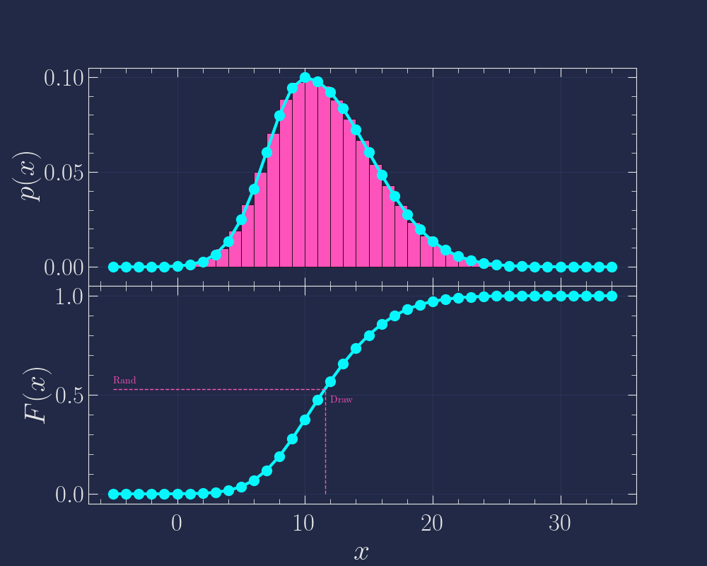
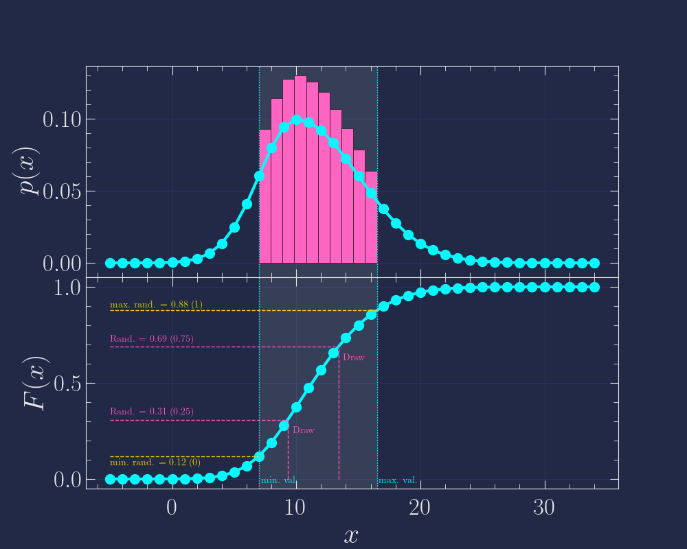

Sampling
========

This section describes how the code samples from an arbitrary cumulative distribution function (CDF).
The concepts are illustrated with figures and examples.

Basic concept
-------------
The idea is to sample uniformly in the :math:`[0,1)` interval and project that onto an arbitrary CDF.
This allows one to sample from the original distribution, following its probability density function (PDF).
The concept is shown in :numref:`CDF sampling`, where the PDF is shown in the top panel, and the corresponding CDF in the bottom panel.
A single uniform drawing in the :math:`[0,1)` interval and it's corresponding x value is shown in pink.
The distribution of 1000 of these drawings is represented as the pink histogram in the top panel ; as expected, this histogram follows the initial PDF.

.. _CDF sampling:

  Visual illustration of the sampling technique.

You may notice that the CDF has a finite number of points, what happens when the uniform random draw does not fall exactly on one of those points ?
In this case, we linearly interpolate between the two nearest points, as shown in :numref:`CDF sampling`.
These capabilities are gathered in the ``sample_from_CDF()`` function:

.. autofunction:: astropalmerio.mc.drawings.sample_from_CDF

Restricting the sampling interval
---------------------------------
Sometimes, one wants to confine a variable to a certain interval during a sampling process.
This is particularly true when performing error propagation in the physical sciences.
For instance, say you measured a distance to be :math:`3 \pm 1` centimeters, if you sample from this, assuming a Normal distribution centered on :math:`3` and with a standard deviation of :math:`1`, you may get some negative values for large enough sample sizes.
In this case, you would restrict the sampling interval to be at minimum :math:`0`.
This can be achieved by passing the ``val_min=0`` argument to the ``sample_from_CDF()`` function.

An illustration of restricting the sampling interval is shown in :numref:`CDF sampling with bounds`.
The bound values are converted into minimum and maximum allowed random draws in the :math:`[0,1)` interval, which is then rescaled; these are shown in orange, while two example draws are shown in pink.
The numbers in parenthesis beside the lines indicate the values in the :math:`[0,1)` interval while the others correspond to the rescaled interval (the actual CDF value which is then converted into x).

.. _CDF sampling with bounds:

  Visual illustration of the sampling technique with bounds applied.